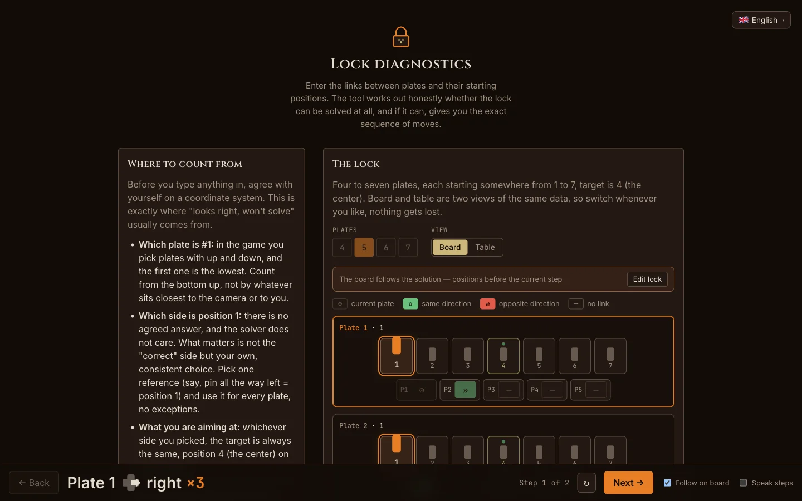

# Gothic 1 Remake — Lockpick Solver

Crack any lock in _Gothic 1 Remake_. Describe the lock in front of you and get the exact, shortest set of moves that opens it — or an honest "this one can't be picked."

**▶ Use it now: [gothic-lockpick-solver.v-be8.workers.dev](https://gothic-lockpick-solver.v-be8.workers.dev)**



## What is this?

Lockpicking in _Gothic 1 Remake_ is a little sliding-plate puzzle. A lock is a stack of plates, each plate has a pin, and you nudge plates left or right to line every pin up on the centre hole. The twist: the plates are linked, so moving one drags others along, and forcing a plate into a wall just wears your lockpick down. It turns into a small logic puzzle, and a tricky lock can eat a fistful of picks.

This tool does the puzzle for you. You tell it how many plates there are, where each pin starts, and how the plates are linked. It works out the shortest safe way to line them all up. If a lock genuinely can't be solved — it happens — it says so, instead of sending you round in circles.

Everything runs in your browser. No account, no ads, nothing is uploaded anywhere.

## How to use it

1. **Pick the number of plates** (4 to 7, depending on the lock).
2. **Set each plate's starting position** — where its pin sits the moment you open the lock (1 to 7; the centre, and the goal, is 4).
3. **Enter the links.** For each plate, mark how the _other_ plates react when you move it — the same way (`»`), the opposite way (`⇄`), or not at all (`—`). Each link is one button that cycles through the three states.
4. **Press Solve.** You get a numbered list of moves. Step through them and watch the right plate light up on the board as you go — or turn on "Speak steps" in the Voice panel and have each move read to you aloud.

The app has a short "Where to count from" note near the top. Read it before you start — a mismatched frame of reference is the usual reason a lock "looks right but won't solve."

## Features

- **Shortest solution, guaranteed.** It searches every reachable state, so the move list is as short as it can be, and it never suggests a move that jams the lock or wastes a pick.
- **Honest about impossible locks.** Some locks really can't be opened (at Master level the skill can strip out a link you needed). The tool tells you rather than pretending.
- **Two ways to enter a lock:** a visual board you click, or a compact table. Switch whenever you like, nothing is lost.
- **Step-by-step playback** that highlights the plate being moved.
- **Voice announcements.** Turn on "Speak steps" in the Voice panel (left column, next to the counting convention) and every step is read aloud in your language — "Plate 6. Right, 3 times." — so you can enter the combination by ear without looking away from the game. A Speed control picks how fast the steps are read. It uses the voices built into your browser, works offline, and the counts are grammatically correct in every language.
- **Hands-free autoplay.** Press Play (or P) and the replay walks itself: each step is read aloud and the bar waits long enough for you to actually press the plates in the game before moving on. Missed one? R repeats the current step.
- **Share a lock as a link.** "Copy link" packs the whole lock into a short URL; whoever opens it gets the lock restored and solved, in their own language.
- **Saved locks.** Every solved lock is remembered locally and can be named and pinned — locks in the game never change, so one solved once never needs re-entering.
- **20 languages,** picked automatically from your browser and switchable in the top-right corner. Your language and the lock you are building are both remembered.

## Languages

English · Deutsch · Polski · Čeština · Slovenčina · Magyar · Română · Українська · Русский · Español · Español (Latinoamérica) · Català · Valencià · Português · Português (Brasil) · Italiano · Français · Nederlands · Türkçe · 简体中文

## Run it yourself

Built with SvelteKit (Svelte 5) and TypeScript; the solver runs in a Web Worker so the UI never freezes. It uses [Bun](https://bun.sh/).

```bash
bun install
bun run dev        # http://localhost:5173
bun run build      # static build for any host
bun run test       # unit + component tests
```

It deploys to Cloudflare Workers with `bunx wrangler deploy`.

## Disclaimer

A fan-made tool, not affiliated with or endorsed by Alkimia Interactive or THQ Nordic. _Gothic_ and _Gothic 1 Remake_ are trademarks of their respective owners.

## License

Released under the [MIT License](./LICENSE).
